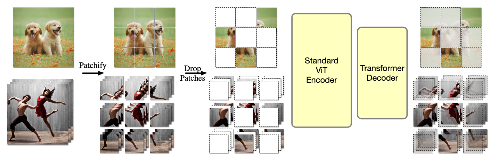

# OmniMAE: Single Model Masked Pretraining on Images and Videos

[[paper](https://arxiv.org/pdf/2206.08356.pdf)]

<p align="center">
    
</p>

**OmniMAE: Single Model Masked Pretraining on Images and Videos.** Transformer-based architectures have become competitive across a variety of visual domains, most notably images and videos. While prior work has studied these modalities in isolation, having a common architecture suggests that one can train a single unified model for multiple visual modalities. Prior attempts at unified modeling typically use architectures tailored for vision tasks, or obtain worse performance compared to single modality models. In this work, we show that masked autoencoding can be used to train a simple Vision Transformer on images and videos, without requiring any labeled data. This single model learns visual representations that are comparable to or better than single-modality representations on both image and video benchmarks, while using a much simpler architecture. In particular,our single pretrained model can be finetuned to achieve 86.5% on ImageNet and 75.3% on the challenging Something Something-v2 video benchmark. Furthermore, this model can be learned by dropping 90% of the image and 95% of the video patches, enabling extremely fast training.

## Model Zoo 

We share checkpoints for the models in the OmniMAE paper. 

**Pre-training checkpoints,**

The models in this table are pretrained jointly pretrained on SSv2 and In1k for 1600 epochs,

| Name           | Model / Checkpoint |
| :---           |:--- |
| OmniMAE ViT-B | [vit_base_mae_pretraining](https://dl.fbaipublicfiles.com/omnivore/omnimae_ckpts/vitb_pretrain.torch) |
| OmniMAE ViT-L | [vit_large_mae_pretraining](https://dl.fbaipublicfiles.com/omnivore/omnimae_ckpts/vitl_pretrain.torch) |
| OmniMAE ViT-H | [vit_huge_mae_pretraining](https://dl.fbaipublicfiles.com/omnivore/omnimae_ckpts/vith_pretrain.torch) |


**Finetuned SSv2 checkpoints,**

| Name          | SSv2 (Top-1) | Model / Checkpoint |
| :---          |    :----   |:--- |
| OmniMAE ViT-B | 69.5       | [vit_base_mae_finetune_ssv2](https://dl.fbaipublicfiles.com/omnivore/omnimae_ckpts/vitb_ssv2_ft.torch) |
| OmniMAE ViT-L | 74.2       | [vit_large_mae_finetune_ssv2](https://dl.fbaipublicfiles.com/omnivore/omnimae_ckpts/vitl_ssv2_ft.torch) |
| OmniMAE ViT-H | 75.3       | [vit_huge_mae_finetune_ssv2](https://dl.fbaipublicfiles.com/omnivore/omnimae_ckpts/vith_ssv2_ft.torch) |


**Finetuned In1k checkpoints,**

| Name          | IN1k (Top-1) | Model / Checkpoint |
| :---          |    :----   |:--- |
| OmniMAE ViT-B | 83.0       | [vit_base_mae_finetune_in1k](https://dl.fbaipublicfiles.com/omnivore/omnimae_ckpts/vitb_in1k_ft.torch) |
| OmniMAE ViT-L | 85.1       | [vit_large_mae_finetune_in1k](https://dl.fbaipublicfiles.com/omnivore/omnimae_ckpts/vitl_in1k_ft.torch) |
| OmniMAE ViT-H | 86.5       | [vit_huge_mae_finetune_in1k](https://dl.fbaipublicfiles.com/omnivore/omnimae_ckpts/vith_in1k_ft.torch) |

## Citation

If this work is helpful in your research, please consider starring :star: us and citing:  

```bibtex
@article{girdhar2022omnimae,
  title={OmniMAE: Single Model Masked Pretraining on Images and Videos},
  author={Girdhar, Rohit and El-Nouby, Alaaeldin and Singh, Mannat and Alwala, Kalyan Vasudev and Joulin, Armand and Misra, Ishan},
  journal={arXiv preprint arXiv:2206.08356},
  year={2022}
}
```

## Contributing
We welcome your pull requests! Please see [CONTRIBUTING](CONTRIBUTING.md) and [CODE_OF_CONDUCT](CODE_OF_CONDUCT.md) for more information.

## License
OmniMAE is released under the CC-BY-NC 4.0 license. See [LICENSE](LICENSE) for additional details. However the Swin Transformer implementation is additionally licensed under the Apache 2.0 license (see [NOTICE](NOTICE) for additional details).

