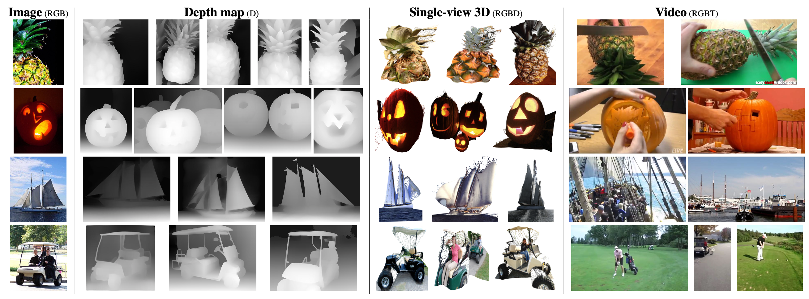

# Omnivore: A Single Model for Many Visual Modalities

[](https://paperswithcode.com/sota/action-recognition-on-epic-kitchens-100?p=omnivore-a-single-model-for-many-visual)  
[](https://paperswithcode.com/sota/semantic-segmentation-on-nyu-depth-v2?p=omnivore-a-single-model-for-many-visual)  
[](https://paperswithcode.com/sota/scene-recognition-on-sun-rgbd?p=omnivore-a-single-model-for-many-visual)  
[](https://paperswithcode.com/sota/image-classification-on-inaturalist-2018?p=omnivore-a-single-model-for-many-visual)  
[](https://paperswithcode.com/sota/action-recognition-in-videos-on-something?p=omnivore-a-single-model-for-many-visual)

[[paper](https://arxiv.org/abs/2201.08377)][[website](https://facebookresearch.github.io/omnivore)]

<p align="center">
    
</p>

   **OMNIVORE is a single vision model for many different visual modalities.** It learns to construct representations that are aligned across visual modalities, without requiring training data that specifies correspondences between those modalities. Using OMNIVORE’s shared visual representation, we successfully identify nearest neighbors of left: an image (ImageNet-1K validation set) in vision datasets that contain right: depth maps (ImageNet-1K training set), single-view 3D images (ImageNet-1K training set), and videos (Kinetics-400 validation set).


This repo contains the code to run inference with a pretrained model on an image, video or RGBD image. 


## Model Zoo 

We share checkpoints for all the Omnivore models in the paper. The models are available via [torch.hub](https://pytorch.org/docs/stable/hub.html), and we also share URLs to all the checkpoints.

The details of the models, their torch.hub names / checkpoint links, and their performance is listed below.

| Name      | IN1k Top 1 | Kinetics400 Top 1     | SUN RGBD Top 1     | Model   |
| :---        |    :----   |          :--- | :--- |:--- |
| Omnivore Swin T      | 81.2       | 78.9   |62.3   | [omnivore_swinT](https://dl.fbaipublicfiles.com/omnivore/models/swinT_checkpoint.torch)   
| Omnivore Swin S   | 83.4       | 82.2      |64.6  | [omnivore_swinS](https://dl.fbaipublicfiles.com/omnivore/models/swinS_checkpoint.torch)  |
| Omnivore Swin B      | 84.0       | 83.3   |65.4   | [omnivore_swinB](https://dl.fbaipublicfiles.com/omnivore/models/swinB_checkpoint.torch)   |
| Omnivore Swin B (IN21k)   | 85.3       | 84.0      |67.2   | [omnivore_swinB_imagenet21k](https://dl.fbaipublicfiles.com/omnivore/models/swinB_In21k_checkpoint.torch)   |
| Omnivore Swin L (IN21k)      | 86.0       | 84.1   |67.1   | [omnivore_swinL_imagenet21k](https://dl.fbaipublicfiles.com/omnivore/models/swinL_In21k_checkpoint.torch) |

Numbers are based on Table 2. and Table 4. in the Omnivore Paper.

We also provide a torch.hub model/checkpoint file for an Omnivore model fine tuned on the Epic Kitchens 100 dataset: [omnivore_swinB_epic](https://dl.fbaipublicfiles.com/omnivore/models/swinB_epic_checkpoint.torch). 


### Setup and Installation   

Omnivore requires PyTorch and torchvision, please follow PyTorch's getting started [instructions](https://pytorch.org/get-started/locally/) for installation. If you are using conda on a linux machine, you can follow the following instructions -

```console
pip install .
```

This will install the required dependencies for you. You can alternatively install the required dependencies manually:

```console
conda create --name omnivore python=3.8
conda activate omnivore
conda install pytorch=1.9.0 torchvision=0.10.0 torchaudio=0.9.0 cudatoolkit=11.1 -c pytorch
```

We also require `einops`, `pytorchvideo` and `timm` which can be installed via pip -
```console
pip install einops
pip install pytorchvideo
pip install timm
```

##### Usage

The models can be loaded via torch.hub using the following command -

```
model = torch.hub.load("facebookresearch/omnivore", model="omnivore_swinB")
```

The class mappings for the datasets can be downloaded as follows: 

```
# Imagenet
wget https://s3.amazonaws.com/deep-learning-models/image-models/imagenet_class_index.json 

# Kinetics
wget https://dl.fbaipublicfiles.com/pyslowfast/dataset/class_names/kinetics_classnames.json 

# SUN RGBD
wget https://dl.fbaipublicfiles.com/omnivore/sunrgbd_classnames.json

# Epic Kitchens
wget https://dl.fbaipublicfiles.com/omnivore/epic_action_classes.csv
```

The list of videos used for Kinetics-400 experiments can be found here: [training](http://dl.fbaipublicfiles.com/omnivore/kinetics400_lists/vidpaths_train.txt) and [validation](http://dl.fbaipublicfiles.com/omnivore/kinetics400_lists/vidpaths_val.txt).


### Run Inference 

Follow the `inference_tutorial.ipynb` tutorial [locally](https://github.com/facebookresearch/omnivore/blob/main/inference_tutorial.ipynb) or [](https://colab.research.google.com/github/facebookresearch/omnivore/blob/main/inference_tutorial.ipynb) for step by step instructions on how to run inference with an image, video and RGBD image.

To run the tutorial you need to install `jupyter notebook`. For installing it on conda, you may run the follwing:

```
conda install jupyter nb_conda ipykernel ipywidgets
```

Integrated into [Huggingface Spaces 🤗](https://huggingface.co/spaces) using [Gradio](https://github.com/gradio-app/gradio). Try out the Web Demo [](https://huggingface.co/spaces/akhaliq/omnivore)

Replicate web demo and docker image is available! You can try loading with different checkpoints here
[](https://replicate.com/facebookresearch/omnivore)

## Citation

If this work is helpful in your research, please consider starring :star: us and citing:  

```bibtex
@inproceedings{girdhar2022omnivore,
  title={{Omnivore: A Single Model for Many Visual Modalities}},
  author={Girdhar, Rohit and Singh, Mannat and Ravi, Nikhila and van der Maaten, Laurens and Joulin, Armand and Misra, Ishan},
  booktitle={CVPR},
  year={2022}
}
```

## Contributing
We welcome your pull requests! Please see [CONTRIBUTING](CONTRIBUTING.md) and [CODE_OF_CONDUCT](CODE_OF_CONDUCT.md) for more information.

## License
Omnivore is released under the CC-BY-NC 4.0 license. See [LICENSE](LICENSE) for additional details. However the Swin Transformer implementation is additionally licensed under the Apache 2.0 license (see [NOTICE](NOTICE) for additional details).

